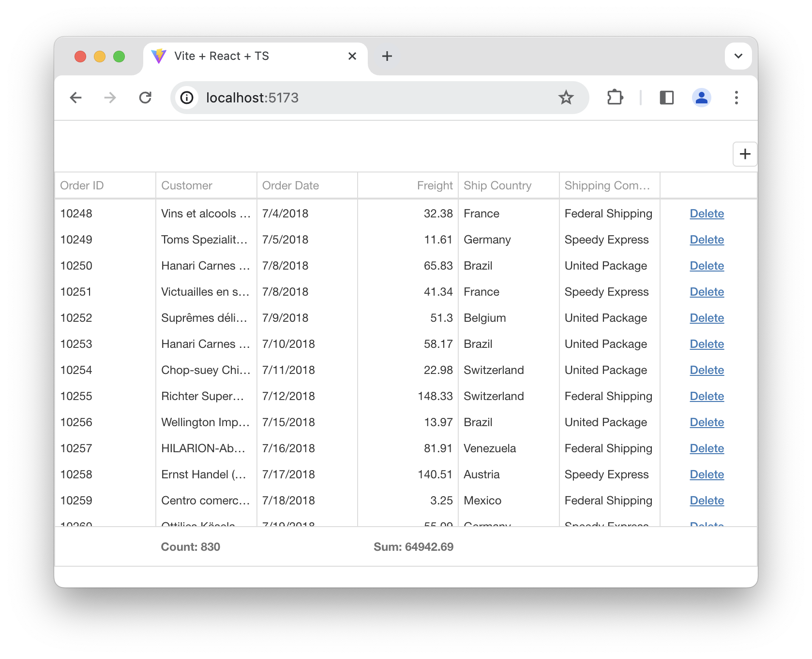

<!-- default badges list -->
[](https://supportcenter.devexpress.com/ticket/details/T1229406)
[](https://docs.devexpress.com/GeneralInformation/403183)
[](#does-this-example-address-your-development-requirementsobjectives)
<!-- default badges end -->

# DevExtreme DataGrid Example: How To Retrieve Data From GraphQL

This example demonstrates how to use GraphQL data sources with DevExtreme. It consists of a server application and a client application.

## Server app

The [/server](/server/) folder contains an Express.js application. The application's GraphQL API serves plain JSON data from the [/data](/data/) folder.

Install server dependencies:

```shell
npm i
```

Launch the server:

```shell
npm run dev
```

## Client app

The [/client/vite-react](/client/vite-react/) folder contains a Vite.js application with a React.js front end. It displays a DataGrid component that queries the server's GraphQL API.

Enter the folder to install client dependencies:

```shell
cd client/vite-react; npm i
```

Launch the application:

```shell
npm run dev:client
```

Open the Vite application in the browser to see the DataGrid in action.


<!-- feedback -->
## Does this example address your development requirements/objectives?

[](https://www.devexpress.com/support/examples/survey.xml?utm_source=github&utm_campaign=devextreme-datagrid-graphql-integration&~~~was_helpful=yes) [](https://www.devexpress.com/support/examples/survey.xml?utm_source=github&utm_campaign=devextreme-datagrid-graphql-integration&~~~was_helpful=no)

(you will be redirected to DevExpress.com to submit your response)
<!-- feedback end -->
